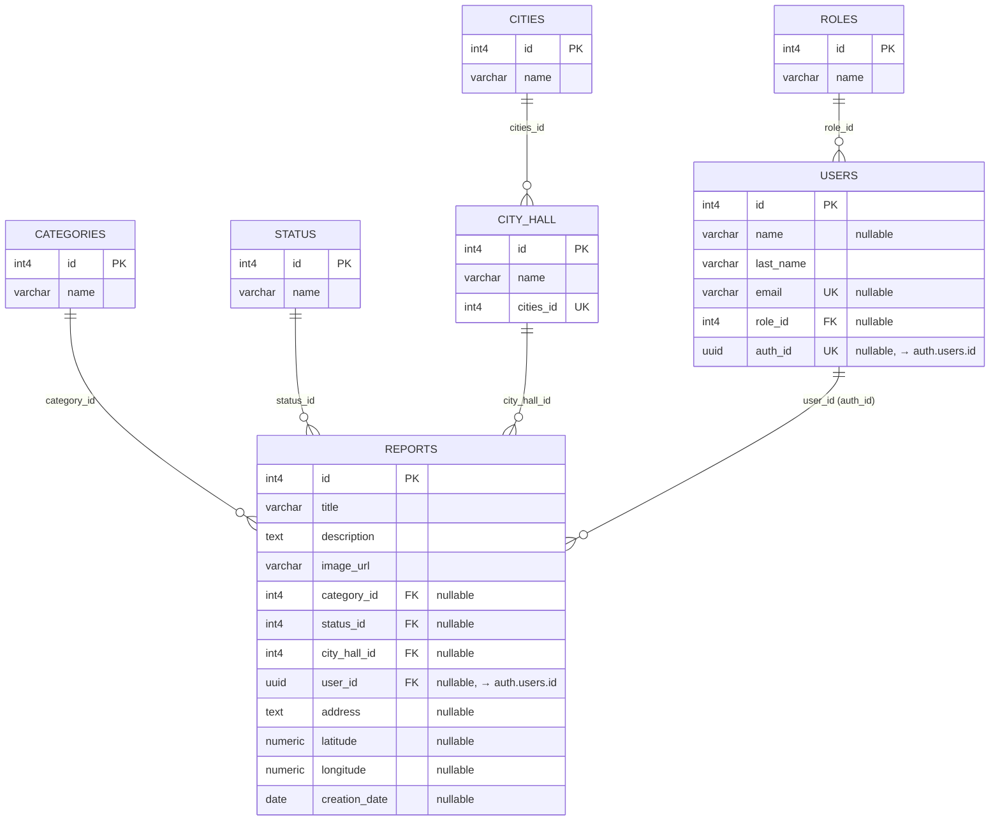

# QuillAlert
QuillAlert is a citizen participation platform that allows the inhabitants of Barranquilla to report urban issues such as damaged roads, garbage accumulation, broken streetlights, traffic signs or security concerns.

## 📖 Description:
citizens can create reports, attach images, specify the location on an interactive map, and track the status of each report. Administrators (City Hall) can review reports, update their status, and organize incidents through an administrative dashboard.

The main goal of this project is to develop a modern Single Page Application (SPA) using Vanilla JavaScript while implementing authentication, role-based access control, REST APIs, and relational databases.

### 🔐 Key Features:
- **Authentication:** User registration, Secure login, Profile management.
- **Citizen Reports:** Create urban incident reports, Upload images, Select location on an interactive map, Categorize reports, View personal reports, Track report status.
- **Interactive map:** Visualize report locations, Navigate through reported incidents.
- **Administration Panel:** Administrators can: View every report, Filter reports by category and status, Update report status, Manage users, and View platform statistics.

## 📂 Project Structure

The project is divided in two main parts:

- **`/client`**: Contains the user interface built with **Vite**, **Tailwind CSS** and **Javascript** vanilla.
- **`/server`**: Contains the backend, Using **Express.js** and **Supabase** as a backend service.

```bash
.
client
│   ├── index.html
│   ├── public
│   │   └── quillalert.svg
│   ├── src
│   │   ├── components/
│   │   ├── config/
│   │   ├── controllers/
│   │   ├── main.js
│   │   ├── router/
│   │   ├── services/
│   │   ├── styles/
│   │   ├── utils/
│   │   └── views/
│   └── vite.config.ts
├── LICENSE
├── README.md
└── server
    ├── server.js
    └── src
        ├── app.js
        ├── config/
        ├── controllers/
        └── routes/
```

## 🛠️ Technologies Used

- **Frontend:** HTML5, JavaScript (ES6+), Tailwind CSS
- **Build Tool:** Vite
- **Backend:** Express.js, REST API, Supabase
- **Database:** PostgreSQL with Supabase
- **External services:** Supabase Storage, Leaflet, OpenStreetMap, sweetAlert2

## 🗃️ Database relational model


## ⚙️ Configuration
1. Create a file `.env` in the folder `client` wit this variables:
```
   VITE_SUPABASE_URL=your_url_of_supabase
   VITE_SUPABASE_ANON_KEY=your_anon_key
   VITE_SUPABASE_BUCKET_NAME=your_bucket
```
2. Create a file `.env` in the folder `server` wit this variables:
```
   SUPABASE_URL=your_url_of_supabase
   SUPABASE_ANON_KEY=your_anon_key
   SUPABASE_SERVICE_ROLE_KEY=your_dervices_role_key
   SUPABASE_BUCKET_NAME=your_bucket
```
3. If you want to try in local change the endpoints in the folder `client/src/services`:
```
   http://localhost:3000/...
```

## 🚀 Installation

1.  First clone the repository:
    ```bash
    git clone https://github.com/Danilo-Doria/QuillAlert.git
    cd QuillAlert
    ```
2.  Install the dependencies in the folder `client`:
    ```bash
    cd client
    npm install
    npm run dev
    ```
3.  Set up and start your server in the folder `server`:
    ```bash
    cd server
    npm install
    npm run dev
    ```

## 🎯 MVP
  the first version of QuillAlert includes: User creations and authentication accounts, Citizen and Administrator roles, reports crud, Upload images, Interactive map with coordenates, Categories, Report status management, Administrative dashboard

  - Future versions will include: Voting system, Notifications, AI classification, Mobile application, Government API integration.

## 📋 Project Management Tools

- Jira — Sprint planning and task management
- GitHub — Version control
- Google documents — Project documentation

## 👨‍💻 Authors

- GitHub: **[Danilo-Doria](https://github.com/Danilo-Doria)**
- GitHub: **[Leonardo-Jimenez](https://github.com/LeonardoFRNG)**
- GitHub: **[Emanuel-Manotas](https://github.com/Emanuel1102)**
- GitHub: **[Stevel-Iglesias](https://github.com/levets01)**
- GitHub: **[Kevin-Bonifacio](https://github.com/kevinBonifacio25)**
- GitHub: **[Luis-Cala](https://github.com/luiscala1)**

## 📄 License

This project was created for educational purposes and personal learning.